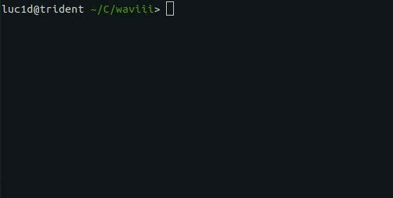

# waviii

ERC-20 Ethereum Token

─── [Custom Crafted Tokens](https://waviii.io) 
─── [iiiWallet (Official waviii Wallet)](https://github.com/luc1dLife/iiiWallet)

    [Solidity v0.5.0]
    [node v10.15.2]
    [npm v5.8.0]
    [Truffle v5.0.5]

    Contract Address: 0xBA00868912Af1a409F11E9c2B5d3a9376Cb3C2E2
[Whitepaper](https://github.com/luc1dLife/waviii/blob/master/Whitepaper.md) | [Etherscan.io](https://etherscan.io/token/0xBA00868912Af1a409F11E9c2B5d3a9376Cb3C2E2) | [waviii.io](https://waviii.io/)